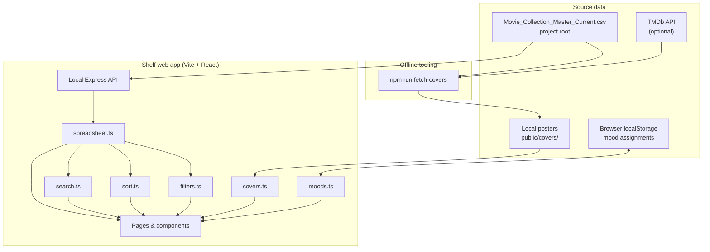
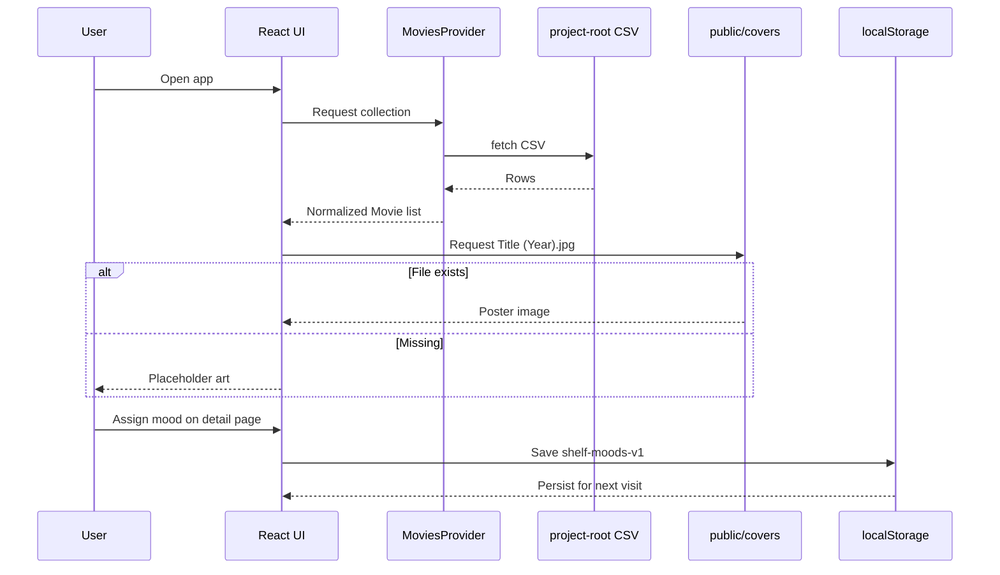
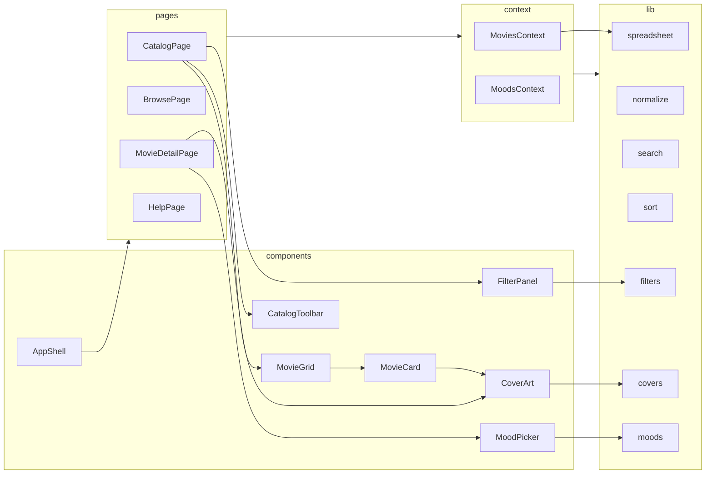
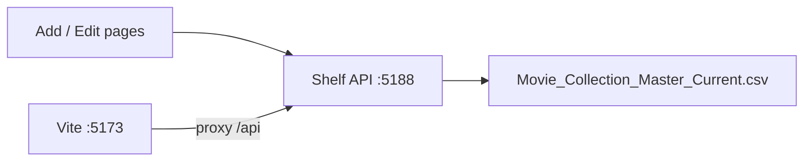

# Shelf — Application Design

Shelf is a **local-only** web app for browsing a physical movie collection (DVD, Blu-ray, UHD 4K). The repo-root spreadsheet is the source of truth. Cover art and mood tags live beside the app on disk / in the browser.

## Goals

- Feel like a personal media library, not a spreadsheet viewer
- Run entirely on the home computer (no paid cloud service required)
- Keep loading, filtering, moods, covers, and UI in separate modules
- Make it easy to add titles (via CSV) and posters (via local files or TMDb fetch script)

## Technology stack

| Layer | Choice | Why |
| --- | --- | --- |
| UI | React + TypeScript + Vite | Fast local dev, modular components |
| Routing | React Router | Catalog, browse, detail, help pages |
| Spreadsheet | Repo-root CSV + Papa Parse | Single file committed with the project |
| Covers | Static files in `public/covers/` | App only displays local images |
| Cover download | Node script + TMDb API | Optional offline poster fetch; separate from the UI |
| Moods | `localStorage` | Persists on this computer/browser without a database |

## High-level architecture

## Runtime data flow

## Module map

## Editing the spreadsheet from the app

A small local Express API (`server/`) reads and writes `Movie_Collection_Master_Current.csv` at the project root.

- `POST /api/movies` — add a row  
- `PUT /api/movies/:catalogId` — update a row  
- `DELETE /api/movies/:catalogId` — remove a row  

`npm run dev` starts the API and the web UI together.

## How records, covers, and moods link

| Concern | Link key | Location |
| --- | --- | --- |
| Movie record | `Catalog ID` (e.g. `MC-0001`) plus spreadsheet columns | `Movie_Collection_Master_Current.csv` (project root) |
| Cover image (preferred) | `Title (Year).jpg` | `public/covers/Alien (1979).jpg` |
| Cover image (fallback) | `Catalog ID.jpg` | `public/covers/MC-0001.jpg` |
| Moods | `Catalog ID` → list of mood labels | Browser `localStorage` key `shelf-moods-v1` |

The UI never downloads posters itself. It only looks for files already present under `public/covers/`.

## Spreadsheet normalization

The CSV columns are preserved as-is for the detail page. Derived display fields clean up common spreadsheet quirks:

| Field | Normalization |
| --- | --- |
| Year | `"2019.0"` → `2019` |
| Runtime | Prefer researched runtime when present |
| Director | Prefer verified/researched director when present |
| Disc format | Split on `/` for filters (e.g. `UHD 4K / Blu-ray`) |
| Franchise/Collection | Long verification notes excluded from browse/filter chips |
| Empty cells | Shown as `—` in the UI |

## User-facing screens

1. **Collection** — searchable, sortable, filterable card grid  
2. **Browse** — jump in by format, studio, edition, franchise, boutique, or mood  
3. **Movie detail** — full spreadsheet fields + mood picker  
4. **Help** — plain-language guide for adding movies and updating covers  

## Design language

- Dark “home theater” theme
- Display type for titles (Fraunces), body type (Outfit)
- Large 2:3 cover cards
- Warm gold accent on charcoal background
- Subtle hover motion on cards; clear empty and error states

## Security & privacy notes

- Runs locally; collection data stays on the machine
- TMDb is contacted only when someone runs `npm run fetch-covers`
- API credentials live in `.env` (not committed)
- Collection spreadsheet is the committed project-root CSV

## Related docs

- [README.md](../README.md) — setup and run commands  
- [public/covers/README.md](../public/covers/README.md) — cover filename rules and fetch script  
- In-app **Help** page — non-technical how-to for day-to-day use  
